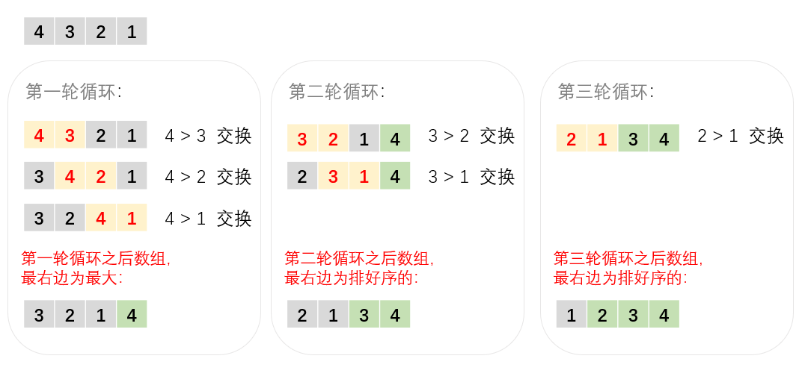
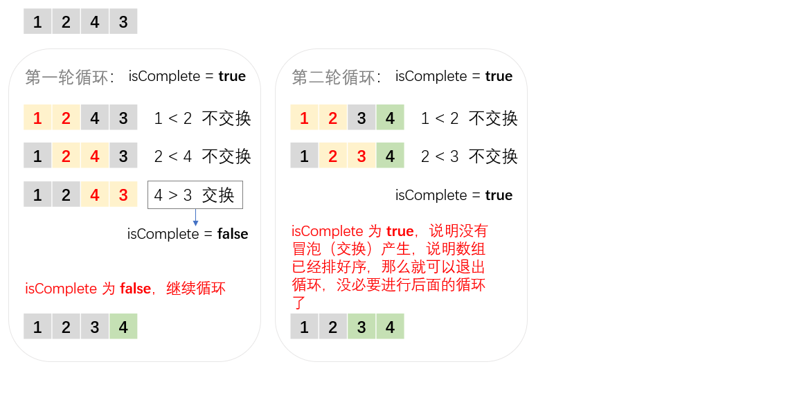

## 算法原理

1. 比较相邻两个元素。如果左边的数大于右边的数，则交换它俩的位置。
2. 对每一组相邻的数都执行 1. 的比较，这样最右边的数将是最大的数（也就是说这个数已经排序完毕）。
3. 下一次循环重复上面两个步骤，但是已经排序完毕的数不再进行比较的操作。
4. 如果一次循环没有冒泡，说明已经是排好序的了，那就退出循环（没必要无脑全部循环遍历完）。

## 算法图解

假设要将 [4, 3, 2, 1] 从小到大进行排序：



可以发现的是最外层只**需要三轮循环**即可，最后一轮结束后那个 "1" 孤苦伶仃地站在最左边，其它都是排好序的，已经没必要再进行进一步比较了。

**需要了解的是，并不是每次都需要将循环结束到底**，可以设置一个标志（isComplete），如果有冒泡（交换）产生，就把 isComplete 置成 false，然后继续循环；如果没有冒泡（交换）的话，isComplete 为 true，就说明当前的数组已经是排好序的了，那就没必要进行后面的循环比较操作了。



## javascript 代码

```javascript
/**
 * 冒泡排序
 * 输入：待排序的数组
 * 输出：从小到大排好序的数组
 */
function bubbleSort(arr) {
  for (let i = 0; i < arr.length - 1; i++) { // 最后一个值不需要再和其它数比较
    let isComplete = true; // 定义是否结束的标志
    for (let j = 0; j < arr.length - 1 - i; j++) {
      // 比较相邻的数
      if (arr[j] > arr[j + 1]) {
        [arr[j], arr[j + 1]] = [arr[j + 1], arr[j]]; // 交换
        isComplete = false; // 设置标志
      }
    }
    // 如果没有交换相邻数，则说明全部的数都是排好序的
    if (isComplete) {
      break;
    }
  }
  return arr;
}

// 测试
let testArr = [9, 4, 6, 8, 1, 3, 2, 5];
console.log(bubbleSort(testArr));

```

