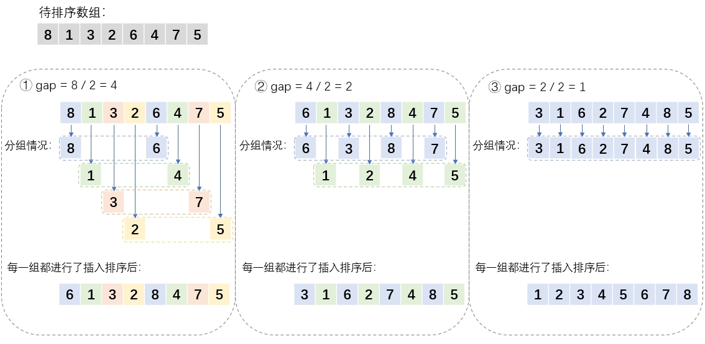

## 算法原理

希尔排序（Shell's Sort）是**插入排序**的一种，又称 “缩小增量排序”（Diminishing Increment Sort），是插入排序的一种更高效的改进版本。希尔排序是非稳定排序算法。该方法因 D.L.Shell 于 1959 年提出而得名。希尔排序是基于插入排序的以下两点性质而提出改进方法的：

1. 插入排序在对几乎已经排好序的数据操作时，效率高，即可以达到线性排序的效率。
2. 但插入排序一般来说是低效的，因为插入排序每次只能将数据移动一位。

希尔排序的基本思想：

1. 按照增量（也就是 "间隔" 或 "步长"）来进行分组。比如增量为 5 ，那么从下标 1 开始的话，下标 1，6，11，16 为一组，从下标 2 开始的话，下标 2，7，12，17 为一组…… 对每组进行直接插入排序算法来进行排序。
2. 减小增量，重复步骤1
3. 直到增量为 1 的时候，数组已经达到了基本有序的状态，这种情况下只需要进行微调即可，不需要进行过多的数据的移动。

### 增量序列

根据上面的基本思想，可以知道增量扮演了很重要的角色，**那么增量初始值该为多少，并以怎样规律减少直到为 1 呢？**这个时候我们就得知道希尔排序的增量序列。希尔排序的增量序列的选择和证明是数学上的问题，我们一般会使用一些常见的增量序列。假设现在有一个数组，长度为 N，那么确认增量初始值以及减少到 1 的规律如下所示。

**常见的增量序列：**

- **Shell 的增量序列**：**N/2**（ N 为数组的长度），N/4，... ，1（N 不断除以 2，直到为 1）。

  如果用了 Shell 的增量序列，那么**增量的初始值就是 N/2**，并且以不断除以 2 的规律减少，直到为 1。

- **Knuth 的增量序列**：**3k + 1**，,,, ，40，13，4，1。k 为本项的右边一项。

  如果用了 Knuth 的增量序列，那么 **增量 = 3*(增量)+1 < N/3**，式子中的 "=" 为赋值操作，**增量**从 1 开始，以 1，4，13 变化，满足这条式子的最大的增量，就是**增量初始值**。增量初始值以 （增量-1）/ 3 的规律减少，直到为 1 。

  ```javascript
  /**
   * 上面的式子用代码写如下所示
   */
  let gap = 1;
  while (gap < len / 3) {
    gap = 3 * gap + 1;
  }
  /**
   * gap < len / 3 这个循环条件保证了 gap 在 Knuth 增量序列的
   * 规律下不会超过数组本身的长度。
   * gap 必为整数，则其最大值为 (len / 3) - 1，这样的话满足循环
   * 条件，进行乘三加一操作：3 * [(len / 3) - 1] + 1 = len - 2，
   * 发现其是小于 len 的，合法。
   */
  ```

## 算法图解

下面以 Shell 的增量序列为例进行图解。假设有数组 [8, 1, 3, 2, 6, 4, 7, 5]，将其从小到达进行排序。



## javascript 代码

```javascript
/**
 * 希尔排序
 * 输入：待排序的数组
 * 输出：从小到大排好序的数组
 */
function shellSort(arr) {
  // // Knuth 增量序列的方式产生 gap
  // let gap = 1;
  // while (gap < arr.length / 3) {
  //   gap = gap * 3 + 1;
  // }

  // Shell 增量序列的方式产生 gap
  let gap = Math.floor(arr.length / 2);

  while (gap >= 1) {
    for (let i = 0; i < arr.length; i++) {
      // 进行插入排序
      for (let j = i; j >= gap; j -= gap) {
        // 若待插入值较小，则换位
        if (arr[j] < arr[j - gap]) {
          [arr[j], arr[j - gap]] = [arr[j - gap], arr[j]];
        }
      }
    }
    // gap = (gap - 1) / 3; // Knuth 增量序列减小方式
    gap = Math.floor(gap / 2); // Shell 增量序列减小方式
  }
  return arr;
}

// 测试
let testArr = [9, 4, 6, 7, 1, 3, 2, 5];
console.log(shellSort(testArr));

```

