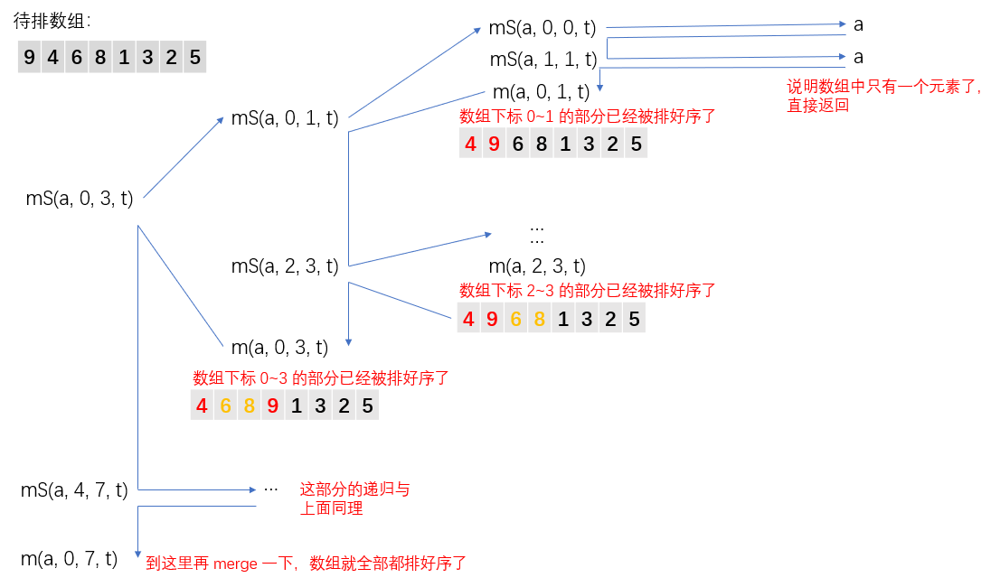

## 算法原理


## 算法图解


## javascript 代码

```javascript
/**
 * 归并排序
 * 输入：
 *    待排序的数组
 *    数组左边界
 *    数组右边界
 *    临时数组
 * 输出：从小到大排好序的数组
 */
function mergeSort(arr, left, right, temp) {
  // 递归进行分治
  if (left < right) {
    // 计算出中间值
    let mid = Math.floor((left + right) / 2);
    mergeSort(arr, left, mid, temp); // 左子数组
    mergeSort(arr, mid + 1, right, temp); // 右子数组
    merge(arr, left, right, temp); // 合并子数组
  }
  return arr;
}

/**
 * 合并子数组
 * 输入：
 *    待排序的数组
 *    子数组左边界
 *    子数组右边界
 *    临时数组
 * 输出：子数组排好序的数组
 */
function merge(arr, left, right, temp) {
  let mid = Math.floor((left + right) / 2);
  let lPointer = left; // 左子数组指针
  let rPointer = mid + 1; // 右子数组指针
  let tPointer = 0; // 临时数组的指针

  // 比较左右子数组，然后把较小的挑出来放到 temp
  while (lPointer <= mid && rPointer <= right) {
    if (arr[lPointer] < arr[rPointer]) {
      // 将左子数组中的值赋值到 temp 数组中
      temp[tPointer++] = arr[lPointer++];
    } else {
      // 右子数组中的值较小，将其赋值到 temp 数组中
      temp[tPointer++] = arr[rPointer++];
    }
  }

  // 左右子数组中的一个已经赋值完，那么将另一个中的剩余值依次赋值到 temp 中即可

  // 左子数组没完，右子数组完了
  while (lPointer <= mid) {
    temp[tPointer++] = arr[lPointer++];
  }

  // 左子数组完了，有子数组没完
  while (rPointer <= right) {
    temp[tPointer++] = arr[rPointer++];
  }

  // 将 temp 数组的内容赋值回原数组中
  tPointer = 0;
  for (let i = left; i <= right; i++) {
    arr[i] = temp[tPointer++];
  }
}


// 测试
let testArr = [9, 4, 6, 8, 1, 3, 2, 5];
let left = 0;
let right = testArr.length - 1;
let temp = [];
console.log(mergeSort(testArr, left, right, temp));

```

