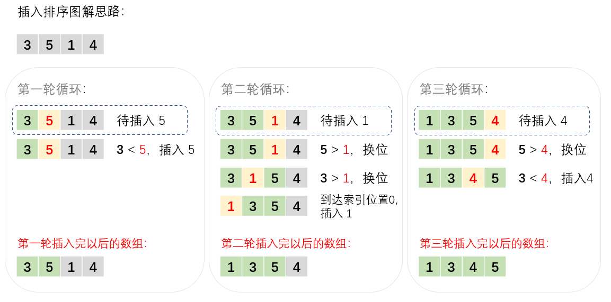

## 算法原理

1. 第一个元素可以认为已经被排序，故我们从第二个元素开始，将其看成待插入值
2. 从待插入值开始，从后往前（从右往左）扫描数组
3. 若已排序数组的值大于待插入值，则换位，然后重复步骤 2
4. 若已排序数组的值小于待插入值，则插入。
5. 然后开始下一轮循环（即重复前面的步骤）

## 算法图解

假设要将 [3, 5, 1, 4] 从小到大进行排序：



## javascript 代码

```javascript
/**
 * 插入排序
 * 输入：待排序的数组
 * 输出：从小到大排好序的数组
 */
function insertionSort(arr) {
  for (let i = 1; i < arr.length; i++) {
    let temp = i; // 记录待插入值的下标
    for (let j = i - 1; j >= 0; j--) {
      if (arr[temp] < arr[j]) { // 若待插入值较小，则换位
        [arr[temp], arr[j]] = [arr[j], arr[temp]];
        temp = j;
      } else {
        // 结束当前循环，即插入了待插入值
        break;
      }
    }
  }
  return arr;
}

// 测试
let testArr = [9, 4, 6, 8, 1, 3, 2, 5];
console.log(insertionSort(testArr));
```

