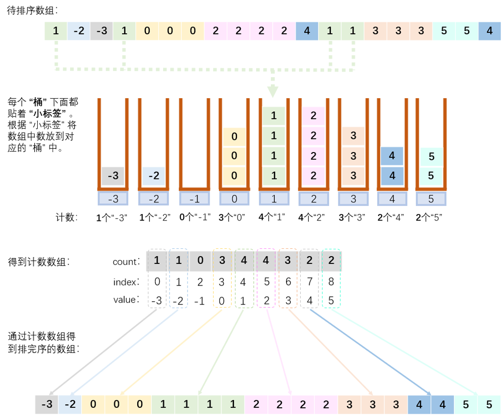

## 算法原理

计数排序是一个分布式排序。分布式排序是使用已经组织好的辅助数据结构（称为 “桶”），来得到排好序的数组。它是用来排序整数的优秀算法（它是一个**整数排序算法**），但是需要更多的内存来存放临时的数组。

它主要的流程就是先通过原数组得到一个计数数组，然后通过计数数组恢复出排好序的数组：原数组——>**计数数组**——>排好序的数组。至于计数数组怎么得到，以及计数数组怎么恢复出原数组的问题，看看下面的例子就知道了。

假设有一个比较常规的数组（数组的最小值是 0，且数组中的每一项都是整数，且数值分布在 0~N 的区间内），常规的计数排序过程是这样的：

1. **因为数组的下标是天然排好序的（从小到大）**，所以我们进行**计数数组的下标**与**原数组的值**进行关联**（这个关联的规律自己心里知道就行）**。最简单的关联就是，计数数组下标是 0，则其对应了原数组中的数组值 0。那么此时，计数数组下标的最大值就对应了原数组中的数值的最大值。
2. 找出原数组中的最大值 N，然后创建长度为 N + 1 的计数数组。比如原数组中的最大值为 20，那么计数数组的下标的最大值也要为 20（即数组下标范围：0 ~ 20），那么数组的长度就是 20 + 1 = 21。
3. 创建完计数数组后，进行计数数组的生成，统计原数组中的值出现的个数。比如原数组中的 2 出现了 3 次，1 出现了 4 次，那么就要在计数数组下标为 2 的地方记一个 3，在下标为 1 的地方记一个 4。
4. 计数数组生成完了就能还原出排好序的数组。计数数组的下标记录的是原数组中出现的值，计数数组的值记录的是这个原数组中的值出现的次数，比如计数数组为 [3, 4, 1]，那么它恢复出的排好序的数组就是 [0, 0, 0, 1, 1, 1, 1, 2]。

### 问题与优化

上面的步骤会存在一点点问题：

1. 如果出现了负整数该咋整？
2. 如果数组中的最大值为 650，但是整个数组中的值在 600 ~ 650 这个区间内，那么如果创建长度为 651 的数组，其中有 600 长度不是浪费了嘛？

这一点点问题的解决方法是，改变计数数组的下标与原数组中的值的关联就行了。也就是对上面的 步骤 1 做出调整。具体的关联方法就是，求出数组中的最大值 **max** 和 最小值 **min**，计数数组的下标 0 不再对应原数组中的值 0，而是对应原数组中的最小值 min。计数数组的长度即为：**max - min + 1**；计数数组的下标与原数组中的值的关联关系为：**index + min = value**，其中 index 为 计数数组的下标，min 为原数组中的最小值，value 为当前计数数组下标对应的原数组里面的值。

将 步骤 1 进行了修改之后，后面的流程按部就班进行即可。

## 算法图解

假设有数组 [1, -2, -3, 1, 0, 0, 0, 2, 2, 2, 2, 4, 1, 1, 3, 3, 3, 5, 5, 4]，将其从小到大进行排序。



通过上面的图解可以发现，**计数排序适用在数组的范围不那么大的情况**，如果数组的范围超级大，那么所需要的计数数组就要超级长，那么内存空间的消耗就是不容乐观的。

## javascript 代码

```javascript
/**
 * 计数排序，没有优化空间
 * 输入：待排序的数组
 * 输出：从小到大排好序的数组
 */
function countingSort1(arr) {
  /**
   * 找到数组中的最大值，
   * 创建相应长度的计数数组（js 是动态的，这一步不要也行）
   */
  let maxValue = findMaxValue(arr);
  let counts = new Array(maxValue + 1); // 创建计数数组
  // let counts = [];

  // 生成计数数组
  for (let i = 0; i < arr.length; i++) {
    let index = arr[i]; // 原数组的值当作计数数组的下标
    if (!counts[index]) {
      counts[index] = 0; // 如果计数值不存在，则先初始化为 0
    }
    // 计数
    counts[index]++;
  }

  // 从计数数组还原出排好序的数组。
  let sortedIndex = 0;
  for (let i = 0; i < counts.length; i++) {
    while (counts[i] > 0) {
      arr[sortedIndex++] = i;
      counts[i]--;
    }
  }
  return arr;
}

/**
 * 计数排序，优化了空间
 * 输入：待排序的数组
 * 输出：从小到大排好序的数组
 */
function countingSort2(arr) {
  /**
   * 找到数组中的最大值和最小值。
   * 通过最大值和最小值可以确定数组的长度并创建计数数组（js 是动态的，这一步不要也行）
   */
  let maxValue = findMaxValue(arr);
  let minValue = findMinValue(arr);
  let counts = new Array(maxValue - minValue + 1); // 创建计数数组
  // let counts = [];

  // 生成计数数组
  for (let i = 0; i < arr.length; i++) {
    // 关联关系为：index + minValue = value
    let index = arr[i] - minValue;
    if (!counts[index]) {
      counts[index] = 0;
    }
    counts[index]++;
  }

  // 从计数数组中恢复出排好序的数组
  let sortedIndex = 0;
  for (let i = 0; i < counts.length; i++) {
    while (counts[i] > 0) {
      arr[sortedIndex++] = i + minValue; // 关联关系为：index + minValue = value
      counts[i]--;
    }
  }
  return arr;
}

/**
 * 找到数组中的最大值
 * 输入：数组
 * 输出：数组中的最大值
 */
function findMaxValue(arr) {
  let max = arr[0];
  for (let i = 1; i < arr.length; i++) {
    if (max < arr[i]) {
      max = arr[i];
    }
  }
  return max;
}

/**
 * 找到数组中的最小值
 * 输入：数组
 * 输出：数组中的最大值
 */
function findMinValue(arr) {
  let min = arr[0];
  for (let i = 1; i < arr.length; i++) {
    if (min > arr[i]) {
      min = arr[i];
    }
  }
  return min;
}

// 测试
let testArr = [9, 4, 6, 7, 1, 3, 2, 5];
console.log(countingSort1(testArr));
let testArr2 = [1, -2, -3, 1, 0, 0, 0, 2, 2, 2, 2, 4, 1, 1, 3, 3, 3, 5, 5, 4];
console.log(countingSort2(testArr2));

```

