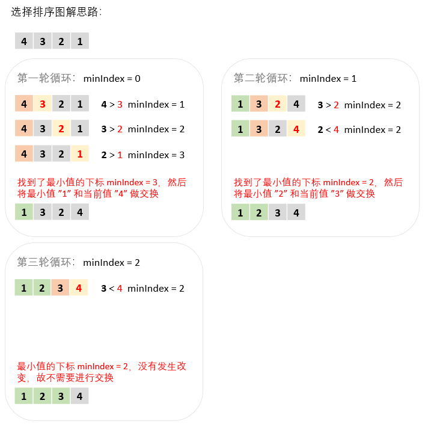

## 算法原理

1. 选取一个当前值，记录其下标为初始的 minIndex
2. 从该当前值开始往后遍历，若遍历到的值比当前值小，那就记录它的下标赋值给 minIndex
3. 一轮循环下来之后 minIndex 对应的是最小值的下标
4. 将最小值和当前值进行交换，然后继续进行上述的操作

## 算法图解

假设要将 [4, 3, 2, 1] 从小到大进行排序：



可以发现最外层只**需要三轮循环**即可，最后一轮循环结束的时候那个 "4" 孤苦伶仃地站在最右边，其它都是排好序的，已经没有必要再去寻找 minIndex 了。

## javascript 代码

```javascript
/**
 * 选择排序
 * 输入：待排序的数组
 * 输出：从小到大排好序的数组
 */
function selectionSort(arr) {
  for (let i = 0; i < arr.length - 1; i++) { // 最后一个值不再需要选择 minIndex 然后交换
    let minIndex = i; // 定义当前值的下标
    for (let j = i + 1; j < arr.length; j++) {
      if (arr[j] < arr[minIndex]) { // 找到比当前值小的下标
        minIndex = j;
      }
    }
    // 当 minIndex 不是当前值下标的时候（也就是找到了比当前值小的数的下标）才交换
    if (minIndex !== i) {
      // 交换
      [arr[i], arr[minIndex]] = [arr[minIndex], arr[i]];
    }
  }
  return arr;
}

// 测试
let testArr = [9, 4, 6, 8, 1, 3, 2, 5];
console.log(selectionSort(testArr));

```

